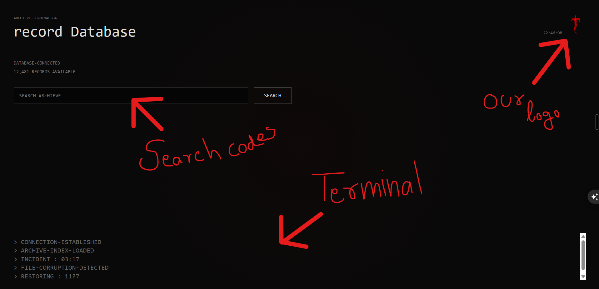

# the-last-tab

Hey yo this is "the-last-tab". An interactive game like web app where you can explore some top secret files and access terminals and find/solve mysteries. Made using Html, css, Javascript, no complicated framework simple codes. You can use it no restrictions (dont tell lies to you friends that its totally made by you 🥲)

# About The Last Tab

hey, Iam Azar (aka NoveOp),
Hmm this is The Last tab, my first horror we game. Its made up with HTML, JS, CSS (mainly JS). If we are going to the game story, you are a 
noob, oh never mind just kidding. You was trying to get access to a high secured archieve dataset where you heard about some rumours on reddit
that there is a unknown entity playing in that website. Maybe an AI ? or a Ghost ?   
yeah your job is to find it. and also the game contains background ambience sound and other sfx so i prefer to keep your volume full and enhanced.

# How can you play ?

Hmm this a story game so you need to just discover the story :x.
Not kidding, there you need to discover hidden codes, timestamps, and more. and at the end i hope you will get the conclusion. look for everywhere in your screen for codes,
timestamps, and even photos contains some clues, which will led you to the final archieve (winning point).

# This may help you :-

# How can you use it ?

-Clone this Repo 
-Open the code with your code editor(I prefer Vs code). 
-If you dont know how to open a cloned code you can use github desktop for that task 
-Install live server extension from the extensions tab in VS code 
-Then you can right click inside your index.html file and preview it :D 
-Dont send it to your friends its a local server (means only you an see it) 